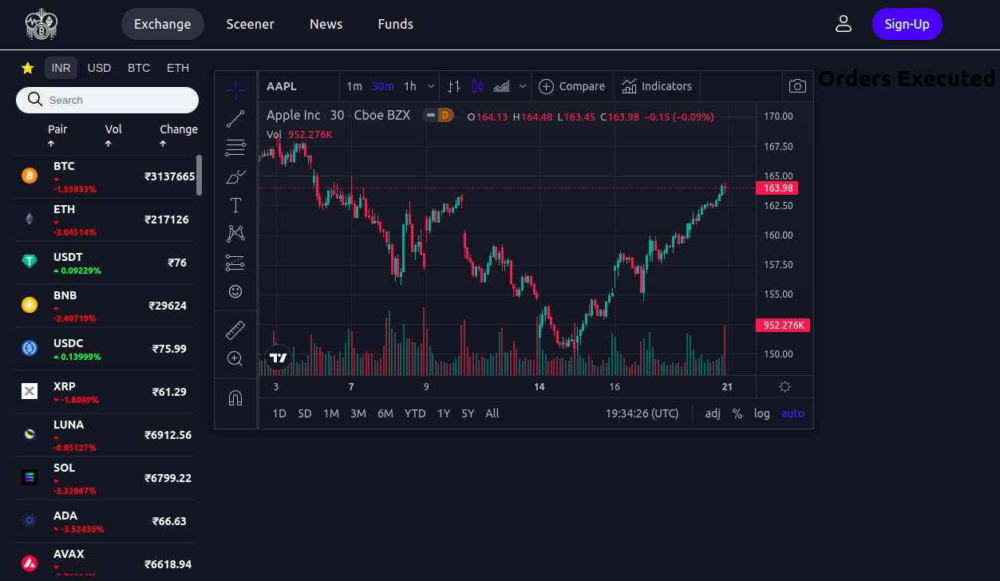

# CryptoVerse

-   A cryptocurrency price prediction & Exchange App

A web application that allows users to view real-time prices for over 200 cryptocurrencies as well as conduct a pseudo-exchange. Users will be able to place false orders (orders without paying money) and see how much profit or loss they would have made if they had completed the trade. The webapp has a personal dashborad for each user to keep track of all the coins in their wallet. Furthermore, it provides indicators for each cryptocurrency backed by our LSTM models in order to forecast the best time to buy or sell the cryptocurrency.

## Features

-   Live prices & charts of over 200 cryptocurrencies
-   Buy/Sell indicators for each cryptocurrency built on LSTM model
-   Pseudo Exchange of crypto
-   User authentication, user dashborad for keeping track of profit/loss

## Tech Stack

**Client:** React, React SDK, TailwindCSS

**Server:** Node, Express, MongoDB, Axios, Binance API, CoinGecko API, Trading View Carts

## Screenshots

#### Homepage



## Environment Variables

To run this project, you will need to add the following environment variables to your .env file in the client directory.

Get the CoinGecko API key from [here](https://rapidapi.com/coingecko/api/coingecko/).

For more info, refer [.env.example](./client/.env.example)

## Run Locally

Clone the project

```bash
  git clone https://github.com/predator4hack/crypto-prediction-exchange-app.git
```

Go to the project directory and install dependencies

```bash
  cd crypto-prediction-exchange-app/app
```

Start the server of both frontend and backend

```bash
  npm start
```

## Roadmap

-   Add user dashboard

## Authors

-   [@predator4hack](https://github.com/predator4hack)
